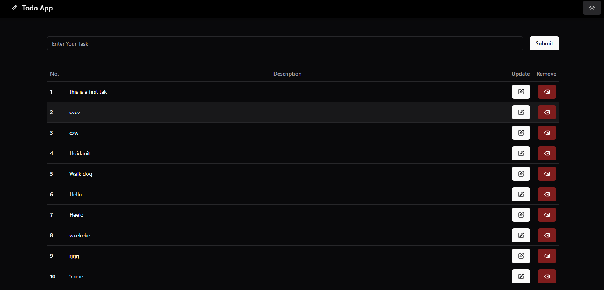

# Todo App Documentation

## Introduction

The TODO App is a simple task management application that allows users to create, read, update and delete (CRUD) tasks efficiently. Built with modern web technologies, it provides a user-friendly interface for managing daily tasks.

## Features

<ul style='font-size: 18px;'>  
  <li>✅ Add New Tasks</li>
  <li>🔍 Views all Tasks</li>
  <li>📝 Edit Existing Tasks</li>
  <li>❌ Delete Tasks</li>
  <li>🎨 Responsive and Clear UI</li>
</ul>

## Technology Stack

<ul style='font-size: 15px;'>  
  <li>Frontend: NextJS-Client (with TypeScript), Tanstack Query (React Query), Tailwind CSS, Shadcn-UI</li>
  <li>Backend: NextJS-Server (with TypeScript), fetch (Api Fetch)</li>
  <li>Database: MongoDB</li>
  <li>Deployment: Vercel (Backend and Frontend)</li>
</ul>

## TODO App Image

